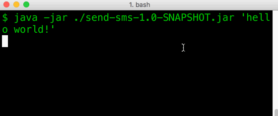

# Twilio Fun

Just me poking around with the Twilio quick start, figuring out how to send an SMS from the command line in Python3 and Java from a trial account

Send like this:

Get a message like this:

## Stuff in here

- `java` - An executable jar that can send SMS to a whitelisted phone number
- `python` - A python script for sending an SMS to a whitelisted phone number

## Setup

0. Sign up for a [Twilio](https://www.twilio.com/try-twilio) account, or log in
0. Create a [Twilio phone number](https://www.twilio.com/console/phone-numbers/) to send from. Note this number.
0. Add your number to the list of [verified caller IDs](https://www.twilio.com/console/phone-numbers/verified) so you can send SMS to it as part of the free trial.
0. Navigate to your [Twilio console](https://www.twilio.com/console), note your Account SID and Auth Token.
0. Open the script and paste the appropriate values into `FROM_NUMBER` (in the format +1 123 456 7890), `TO_NUMBER` (in the format +1 123 456 7890), `ACCOUNT_SID`, and `AUTH_TOKEN`. 
    - Python - `python/send_sms.py`
    - Java - `java/src/main/java/SendSms.java`
0. Run the script:
     - Python 

          $ cd python
          $ python3 send_sms.py 'hello!'

    - Java
    
          $ cd java
          $ mvn package
          $ cd target
          $ java -jar send-sms-1.0-SNAPSHOT.jar 'message'
